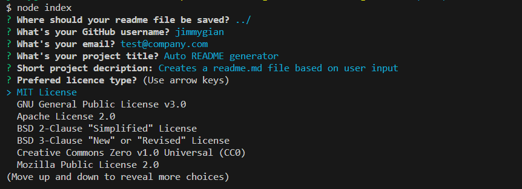

# CLI README.md Generator

This repository contains a Command Line Interface (CLI) application that facilitates the creation of a README.md file for your projects. The application, built using Node.js and inquirer.js, prompts users with a series of questions to gather essential information about their project. Subsequently, it generates a well-structured README.md file based on the provided responses.



## Table of Contents

- [Installation](#installation)
- [Usage](#usage)
- [Features](#features)
- [Functions](#functions)
- [License](#license)
- [Questions](#questions)

## Installation

To install the necessary dependencies, follow these steps:

1. Clone the repository to your local machine.
2. Navigate to the project directory using the command line.
3. Run the command: `npm install`


## Usage

To run the CLI application and generate a README.md file, use the following command:

```
node index.js
```

The application will prompt you with a series of questions, covering various aspects of your project. Once all questions are answered, a README.md file will be generated in the specified directory.


## Features

1. **Directory Selection:** Users can choose the directory where the README.md file should be saved. The default is the current working directory.

2. **GitHub Username Validation:** Ensures the provided GitHub username is valid.

3. **Email Validation:** Validates the provided email address or allows leaving it blank.

4. **License Selection:** Users can choose a preferred license type from a list of popular GitHub licenses.

5. **Customizable Commands:** Users can specify commands for installing dependencies and running tests.

6. **Project Usage Description:** Allows users to describe how to use the project.

7. **Collaboration and Contribution Information:** Includes sections for users to provide details about using the repository and contributing to the project.


## License

This project is licensed under the MIT license.


## Questions

If you have any questions or concerns about the CLI application, please feel free to reach out:

- GitHub: [jimmygian](https://github.com/jimmygian)
